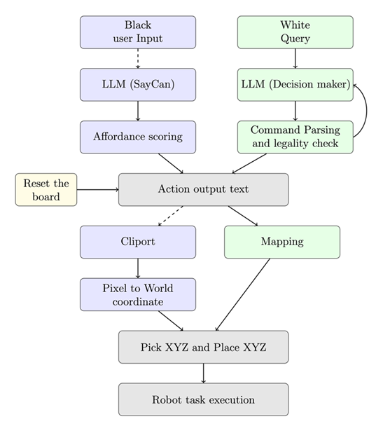
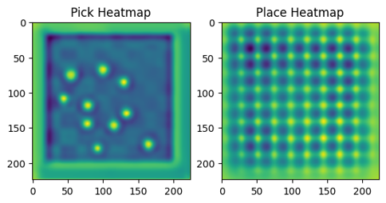

# 🤖 LLM & Vision-Controlled Robotic Chess Player ♟️

[](https://opensource.org/licenses/MIT)

This project explores the fusion of high-level intelligence from **Large Language Models (LLMs)** and **Vision-Language Models (VLMs)** with low-level robotic control. It features two primary approaches to enable a UR5e robotic arm to play chess in a PyBullet simulation:

1.  **LLM-Driven Strategy:** A human player provides strategic guidance in natural language (e.g., "Play the Italian Opening"), and a GPT model generates the corresponding sequence of moves.
2.  **Vision-Based Manipulation:** The **CLIPORT** model uses camera input and a text prompt to determine the precise pick-and-place locations for a given task.

---

## 🚀 Showcase & Demos

### LLM-Guided Chess Openings
The LLM successfully executes famous chess openings against a human player based on a single strategic instruction.

| Giuoco Piano Opening | London System Opening | Nimzowitsch-Larsen Attack |
| :------------------: | :-------------------: | :-----------------------: |
|     |     |    |

### CLIPORT Vision-Based Task
This video shows the trained CLIPORT model executing a pick-and-place task based on visual input and a text command.

[](https://www.youtube.com/watch?v=dQw4w9WgXcQ)
*<p align="center">Click the image to watch the full video demo.</p>*


---

## 🔧 How It Works: Part 1 - LLM-Driven Chess

The core of the LLM-driven approach is a pipeline that translates a high-level strategic goal into a physical robot action.


*<p align="center">Figure: The system pipeline for language-to-action translation.</p>*

1.  **Prompt Engineering:** The LLM is given a detailed prompt containing the game history (PGN), a list of all valid pieces, and a strategic objective.
2.  **LLM Inference:** The LLM (GPT-4o-mini) returns a candidate move in a structured format, like `"Pick the white Pawn 3 and place it on e4"`.
3.  **Parsing & Validation:** The output is parsed and rigorously checked against the `python-chess` engine to confirm its legality. If the move is illegal, feedback is sent to the LLM for a retry.
4.  **Action Execution:** The validated move is translated into XYZ coordinates, and the UR5e arm executes the pick-and-place sequence in the PyBullet simulation.

---

## 👁️ How It Works: Part 2 - Vision-Based Control with CLIPORT

CLIPORT (CLIP-Transporter) enables the robot to understand tasks by combining language and vision. It determines *where* to pick and *where* to place an object.

### 1. Data Generation for Training
To train CLIPORT for our tasks, we first generated a dataset of 8,000 samples. The process involves creating various scenes, generating text prompts, and recording the correct pick and place coordinates.

<p align="center">
  
</p>
*<p align="center">Figure: The automated pipeline for generating training data.</p>*

### 2. The TransporterNets Architecture
CLIPORT is powered by an architecture called TransporterNets, which uses two parallel streams to process visual information and fuse it with text features from a language model (CLIP).

<p align="center">
  
</p>
*<p align="center">Figure: A high-level view of the CLIPORT model architecture.</p>*

- **Pick Network:** Identifies the best location to pick an object from the full image.
- **Query Network:** Takes the text features and a cropped image of the picked object to understand *what* the robot is holding.
- **Key Network:** Scans the full image to find features that match the object being held.
- **Cross-Correlation:** Creates an "attention" heatmap that shows where the object should be placed.

### 3. Generating Pick & Place Affordances
The output of the model is two heatmaps: one for picking and one for placing. The brightest spot on each map represents the model's prediction for the best coordinate to perform the action.

<p align="center">
  
</p>
*<p align="center">Figure: The Pick Heatmap (left) shows where to grab an object, and the Place Heatmap (right) shows where to put it.</p>*

---

## 🛠️ Installation & Usage

### Prerequisites
- Python 3.8+
- [Git](https://git-scm.com/)

### Instructions
1.  **Clone the repository:**
    ```bash
    git clone https://github.com/YOUR_USERNAME/LLM-Robotic-Chess-Player.git
    cd LLM-Robotic-Chess-Player
    ```

2.  **Set up a virtual environment (recommended):**
    ```bash
    # Create the environment
    python -m venv venv
    # Activate it
    source venv/bin/activate  # On Windows, use `venv\Scripts\activate`
    ```

3.  **Install dependencies:**
    ```bash
    pip install -r requirements.txt
    ```

4.  **Set up your API Key:**
    Create a `.env` file in the root directory and add your OpenAI API key:
    ```
    OPENAI_API_KEY="your_secret_key_here"
    ```
    *_Note: The program will load this key automatically. The `.gitignore` file is configured to prevent this file from being uploaded to GitHub._

5.  **Run the simulation:**
    ```bash
    python src/main.py
    ```

---

## 📖 Project Report

For a detailed explanation of the project's methodology, experiments, and results, please see the full **[Project Report](./report/project_report.pdf)**.

---

## 👥 Acknowledgments

This was completed as a group project for the "AI & Robotics" course at **Politecnico di Milano**.

-   **Team:** Mohsen Ghasemi, Aidin Latifi, Shiyuan Liu
-   **Professor:** Loris Roveda
